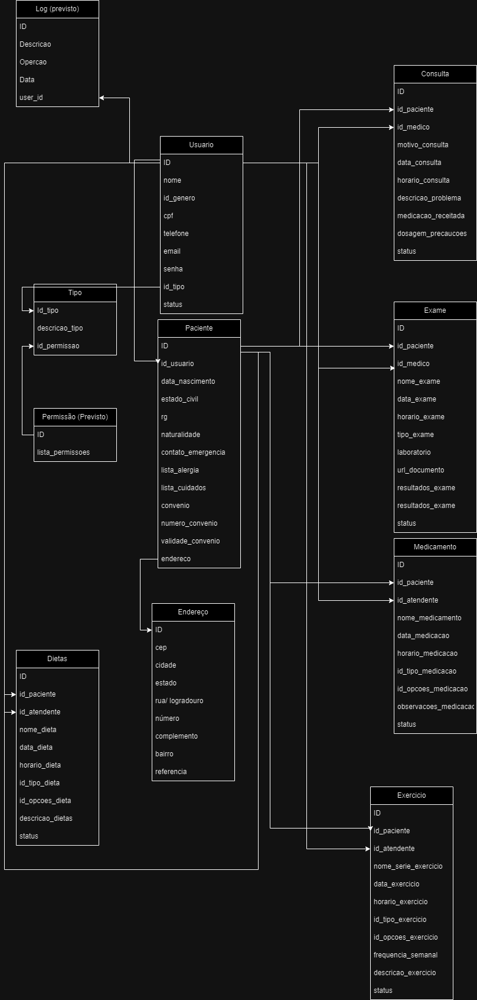

# MEDI TECH PRO

Este é um projeto Express para uma aplicação do sistema hospitalar MEDI TECH PRO. A aplicação gerencia o cadastro de pacientes, médicos, enfermeiros e o registro de consultas, exames, dietas, exercícios e medicamentos.


## 🎯 Contexto

 A MEDI TECH, empresa líder no segmento tecnológico para gestão hospitalar, foi selecionada em edital e recebeu um aporte financeiro para aprimorar seu produto principal, tornando-o capaz de ser utilizado em postos de saúde e clínicas particulares por todo o país.
 
 O objetivo desta aplicação é a criação de uma API Rest:
 - Faça registros e manutenção dos cadastros de médicos, enfermeiros e pacientes.
 - Faça os registros de atendimentos dos médicos, contendo informações sobre consultas e exames.
 - Faça o registro de atendimentos dos enfermeiro, contendo informações sobre dietas, exercícios e medicamentos.

 Esse projeto foi realizado em conjunto com o Frontend (https://github.com/FullStack-Trindade/M3P-FrontEnd-Squad1), simulando um produto completo.

 Essa aplicação foi criada como projeto de conclusão do Módulo 3 Curso de Capacitação Dev FullStack oferecido pelo Lab365 / Senai - SC.

## ⚙️ Funcionalidades

As APIs disponibilizam informações a respeito de:

- Autenticação de Usuário
- Usuários
- Pacientes
- Consultas
- Exames
- Prontuários
- Exercícios
- Dietas
- Medicamentos

Para mais detalhes, consulte a sessão "Documentação da API" deste documento.

## 🛠️ Tecnologias

- [Ecma Script/ Java Script](https://www.ecma-international.org)
- [NodeJs](https://nodejs.org)
- [Postgrees](https://www.postgresql.org)

- [Corsjs](https://www.npmjs.com/package/bcrypt) - Biblioteca para hashing de senhas.
- [Corsjs](https://www.npmjs.com/package/cors)-Middleware para habilitar o suporte a CORS.
- [Expressjs](https://expressjs.com)- Framework web para Node.js.
- [Jsonwebtoken](https://www.npmjs.com/package/jsonwebtoken)- Implementação de tokens JWT para autenticação.
- [Nodemailer](https://nodemailer.com)- Biblioteca para envio de e-mails.
- [PgAdmin](https://www.pgadmin.org)- Cliente PostgreSQL para Node.js.
- [Sequelize](https://sequelize.org)- ORM para bancos de dados SQL.
- [Swagger - JS Docs](https://swagger.io)- Geração de especificações Swagger a partir de código JSDoc.
- [Swagger - UI Express](https://swagger.io)-  Interface de usuário Swagger para Express.
- [Yup](https://www.npmjs.com/package/yup) - Biblioteca para validação de esquemas. 

** Variáveis de Ambiente

Para rodar esse projeto, você deve renomear o arquivo ".env.example" para ".env" e alterar as variáveis antes de rodar localmente.

## 💻 Rodando localmente

Com o node.js(v16) instalado. Siga os passos abaixo:

Clone o projeto

```bash
  git clone https://github.com/FullStack-Trindade/M3P-BackEnd-Squad1.git
```

Entre no diretório do projeto

```bash
  cd my-project
```

Instale as dependências

```bash
  npm i
```

Inicie o servidor

```bash
  npm start
```
Pronto! Agora verifique no seu terminal se a mensagem "Conexão com banco de dados bem sucedida" e "Servidor rodando na porta <SUA_PORTA>" está aparecendo.

## 🗂️ Documentação da API

A documentação completa dos endpoints da API está disponível no Swagger. Acesse http://localhost:<SUA_PORTA>/docs para explorar a documentação interativa.

Para o desenvolvimento deste projeto e realização de testes de API foi utilizado o [Insomnia](https://insomnia.rest/download).

## 🌲 Estrutura

```
public
│ 
src
├───controllers
│   ├───appointment
│   ├───auth
│   ├───diet
│   ├───exams
│   ├───exercise
│   ├───medications
│   ├───password
│   ├───patientRecord
│   ├───patients
│   ├───session
│   └───user
├───database
├───middlewares
│   ├───appointment
│   ├───diet
│   ├───exam
│   ├───exercise
│   ├───medication
│   ├───patient
│   └───user
├───models
├───routes
└───utils
    └───email
        └───template

```

## 🗃️ Diagrama de Classes



## ✏️ Aprendizados da Equipe

- Criação de API Rest utilizando Express.JS;
- Exploração Banco de Dados Relacional Postgree, utilizando Sequelize;
- Lidar com reras de negócios complexas;
- Integração com Frontend;
- Trabalho em equipe e gitflow;

## 🚀 Melhorias Futuras

1- Registro dos Logs de usuário;

2- Expandir relacionamento de tabelas para facilitar a manutenção, expansão e integridade das informações;

## ✍🏻 Autores

Feito por 🔥Furious Five🔥 (Squad 1), composto por [Beatriz Christie](https://github.com/biachristie),  [Daniel Simoni](https://github.com/DaniSimoni), [Gabriel Pacheco](https://github.com/gabrieldelpacheco), [Reinaldo Porto](https://github.com/portexrp) e [Rodrigo Pieritz](https://github.com/rodrigopieritz) (P.O)🖐🏻

## 🛠️ Feedback e Suporte

Se você tiver algum feedback ou algo não estiver funcionando, por favor nos deixe saber por meio de rodrigo_o_pieritz@estudante.sesisenai.org.br

## 📌 Licença

Este código está sob a Licença MIT, cujo texto pode ser lido em [MIT License](https://github.com/FullStack-Trindade/M3P-BackEnd-Squad1/blob/main/LICENSE.md).